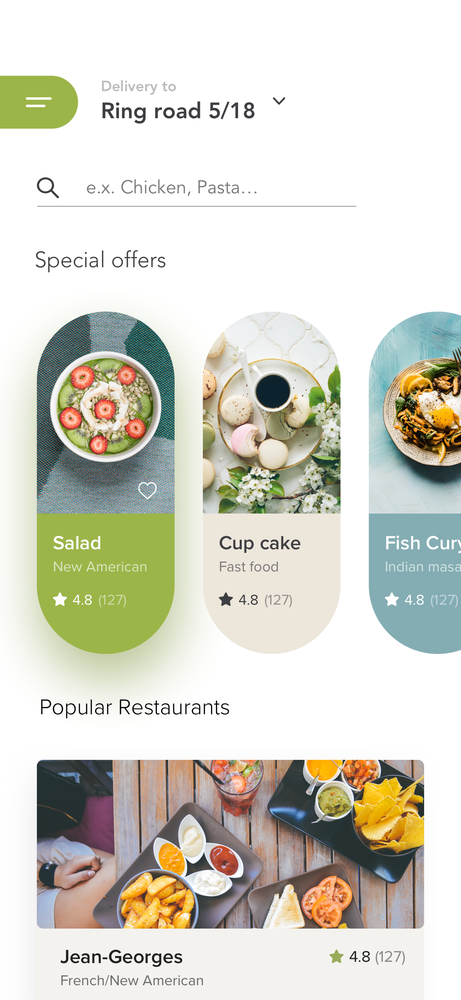

# food_delivery_app

A new Flutter project.

### UI design by [Raf Redwan on dribbble](https://dribbble.com/shots/5998580-Food-Delivery-App)

#### Redesign of Food Delivery App
### Finished project demos
#### Images
<table>
   <tr>
      <td> image 1</td>
      <td> image 2</td>
      <td> image 3</td>
   </tr>
   <tr>
      <td></td>
      <td></td>
      <td></td>
   </tr>
</table>

#### Vid on mobile

## Original design
<table>
   <tr>
      <td> org 1</td>
      <td> org 2</td>
      <td> org 3</td>
   </tr>
   <tr>
      <td></td>
      <td></td>
      <td></td>
   </tr>
</table>

## credits
Dribbble: UI designer `RAF REDWAN`

## Getting Started

This project is a starting point for a Flutter application.

A few resources to get you started if this is your first Flutter project:

- [Lab: Write your first Flutter app](https://flutter.dev/docs/get-started/codelab)
- [Cookbook: Useful Flutter samples](https://flutter.dev/docs/cookbook)

For help getting started with Flutter, view our
[online documentation](https://flutter.dev/docs), which offers tutorials,
samples, guidance on mobile development, and a full API reference.
